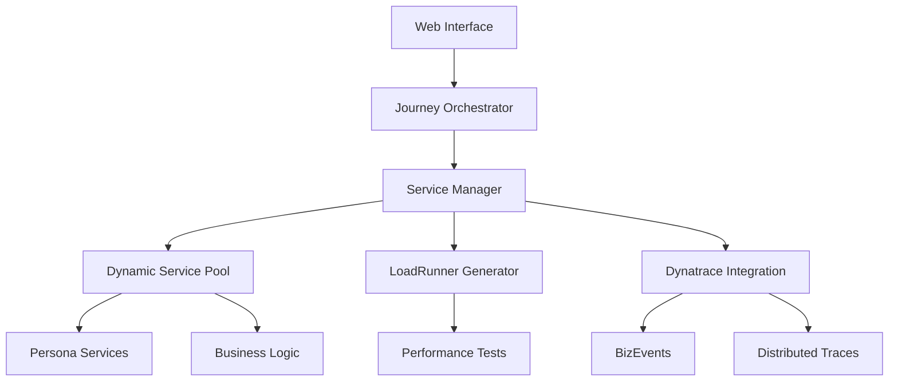

--8<-- "snippets/2-getting-started.js"

# Getting Started

Welcome to the BizObs Journey Simulator - your comprehensive platform for business observability, performance testing, and customer journey analysis! This guide will walk you through setting up the full application suite and exploring its powerful features.

## 🎯 What You'll Build

By the end of this guide, you'll have a complete business observability platform featuring:

- **🎭 Multi-Persona Journey Simulation**: 4 detailed customer personas with realistic behaviors
- **📊 Real-Time Business Metrics**: Revenue, conversion rates, and customer satisfaction tracking  
- **🔄 LoadRunner Integration**: Automated performance test generation and execution
- **� Dynatrace BizEvents**: Business KPI tracking and correlation with technical metrics
- **🎪 Advanced Error Simulation**: Realistic failure scenarios for resilience testing
- **🏗️ Microservices Architecture**: 15+ dynamic services with intelligent orchestration
- **🚀 Production-Ready Deployment**: Kubernetes, Nginx, and CI/CD configurations

## 🔧 Prerequisites & Architecture Overview

### Required Components
- **GitHub Account**: For Codespaces or repository access
- **Dynatrace Environment**: SaaS or Managed tenant with BizEvents enabled
- **Node.js 18+**: For local development (automatic in Codespaces)
- **Docker** (Optional): For containerized deployment

### Application Architecture


## 🚀 Quick Start (5 Minutes)

### GitHub Codespaces (Recommended)

!!! tip "Instant Environment"
    Pre-configured with all dependencies, extensions, and integrations ready to use.

1. **Launch Codespace**
   ```bash
   # Navigate to: https://github.com/dynatrace-wwse/bizobs-journey-simulator
   # Click: Code → Codespaces → Create codespace on main
   ```

2. **Auto-Configuration** (happens automatically)
   - Node.js dependencies installed
   - Services architecture initialized  
   - Development environment configured

3. **Start the Platform**
   ```bash
   cd app
   npm start
   ```

4. **Access the Interface**
   - Web UI: Port 8080 (auto-forwarded)
   - API Endpoints: Port 8080/api/*
   - Microservices: Ports 8083-8099 (dynamic allocation)

## 🔧 Full Local Setup

### Option 1: Standard Node.js Setup

```bash
# Clone and initialize
git clone https://github.com/dynatrace-wwse/bizobs-journey-simulator.git
cd bizobs-journey-simulator/app

# Install dependencies
npm install

# Configure Dynatrace (optional)
export DT_TENANT="https://abc12345.live.dynatrace.com"
export DT_API_TOKEN="your-api-token"

# Start the application
npm start
```

### Option 2: Production Setup with OneAgent

```bash
# Install Dynatrace OneAgent (follow official guide)
# Download from: https://docs.dynatrace.com/docs/ingest-from/dynatrace-oneagent

# Clone and setup
git clone https://github.com/dynatrace-wwse/bizobs-journey-simulator.git
cd bizobs-journey-simulator

# Use production startup script
chmod +x start-server.sh
./start-server.sh
```

### Option 3: Container Deployment

```bash
# Docker Compose (includes nginx, services)
docker-compose up -d

# Or Kubernetes deployment
kubectl apply -f app/k8s/
```

## 🎮 Application Tour & Key Features

### 🏠 Main Dashboard Overview

When you access http://localhost:8080, you'll see:

1. **Journey Control Panel**
   - Real-time simulation controls
   - Performance metrics dashboard
   - Active session monitoring

2. **Persona Selection Hub**
   - 4 detailed customer personas with behavioral patterns
   - Customizable journey configurations
   - Success rate and conversion tracking

3. **Business Metrics Display**
   - Revenue per journey: $0-$500 range
   - Conversion rates: Success/failure percentages
   - Customer satisfaction scores
   - Time-to-completion analytics

### 🎭 Customer Personas Deep Dive

#### 1. Karen - Retail Customer
```json
{
  "profile": "Price-conscious mobile shopper",
  "behavior": {
    "device": "mobile-first",
    "speed": "quick decisions", 
    "price_sensitivity": "high",
    "loyalty": "deal-driven"
  },
  "journey_preferences": ["e-commerce", "deals", "fast-checkout"],
  "typical_revenue": "$45-85",
  "conversion_rate": "68%"
}
```

#### 2. Raj - Insurance Professional  
```json
{
  "profile": "Risk-aware thorough researcher",
  "behavior": {
    "device": "desktop-preferred",
    "speed": "methodical analysis",
    "research": "extensive comparison",
    "trust": "brand-focused"
  },
  "journey_preferences": ["insurance", "financial", "comparison"],
  "typical_revenue": "$180-350",
  "conversion_rate": "84%"
}
```

#### 3. Alex - Tech Enthusiast
```json
{
  "profile": "Innovation-focused early adopter",
  "behavior": {
    "device": "multi-platform",
    "speed": "rapid exploration",
    "features": "cutting-edge preference",
    "integration": "API-savvy"
  },
  "journey_preferences": ["tech", "innovation", "integration"],
  "typical_revenue": "$95-180",
  "conversion_rate": "72%"
}
```

#### 4. Sophia - Enterprise Buyer
```json
{
  "profile": "Process-oriented compliance-focused",
  "behavior": {
    "device": "desktop-enterprise",
    "speed": "deliberate evaluation",
    "compliance": "regulatory-aware",
    "approval": "multi-stakeholder"
  },
  "journey_preferences": ["enterprise", "compliance", "approval-flow"],
  "typical_revenue": "$2500-5000",
  "conversion_rate": "91%"
}
```

### 🎪 Journey Templates & Scenarios

#### 1. E-Commerce Journey (Karen's Specialty)
```bash
Discovery → Browse → Compare → Cart → Checkout → Payment → Confirmation
```
- **Duration**: 3-8 minutes
- **Services Involved**: 8 microservices
- **Business Events**: 12 key touchpoints
- **Revenue Impact**: $45-85 per completion

#### 2. Insurance Policy Journey (Raj's Domain)
```bash
Research → Quote → Compare → Application → Underwriting → Payment → Policy Issue
```
- **Duration**: 15-25 minutes
- **Services Involved**: 12 microservices
- **Business Events**: 18 key touchpoints  
- **Revenue Impact**: $180-350 per completion

#### 3. Enterprise SaaS Journey (Sophia's Process)
```bash
Evaluation → Demo → Trial → Procurement → Approval → Contract → Activation
```
- **Duration**: 45-90 minutes (enterprise complexity)
- **Services Involved**: 15 microservices
- **Business Events**: 24 key touchpoints
- **Revenue Impact**: $2500-5000 per completion

## 🔄 LoadRunner Integration & Performance Testing

### Automated Test Generation

The platform automatically generates LoadRunner C-scripts based on your journey simulations:

1. **Access LoadRunner Integration**
   ```bash
   curl -X POST http://localhost:8080/api/loadrunner/generate
   ```

2. **Generated Artifacts**
   - `app/loadrunner-tests/`: Test scenarios and scripts
   - **C-Scripts**: Ready-to-run LoadRunner tests
   - **Config Files**: Test parameters and data sets
   - **Scenarios**: Light, Medium, Heavy, Spike, Stress test configs

3. **Performance Test Scenarios**
   ```bash
   # View available scenarios
   ls app/loadrunner-tests/scenarios/
   
   # Output:
   # light-load.json    - 10 users, 5 min ramp
   # medium-load.json   - 50 users, 10 min ramp  
   # heavy-load.json    - 200 users, 15 min ramp
   # spike-test.json    - 500 users, 1 min spike
   # stress-test.json   - 1000 users, sustained load
   ```

### LoadRunner Script Generation
```c
// Auto-generated LoadRunner script example
Action()
{
    lr_start_transaction("BizObs_Journey_Karen_ECommerce");
    
    // Discovery Phase with business context
    lr_start_transaction("Product_Discovery");
    web_custom_request("discovery_api", 
        "URL=http://localhost:8080/api/journey/discover",
        "Method=POST",
        "Body={\"persona\":\"Karen\",\"category\":\"retail\"}",
        LAST);
    lr_end_transaction("Product_Discovery", LR_AUTO);
    
    // Continue with full journey simulation...
    lr_end_transaction("BizObs_Journey_Karen_ECommerce", LR_AUTO);
    return 0;
}
```

## 📊 Dynatrace Integration & Business Events

### BizEvents Configuration

The platform automatically sends business events to Dynatrace:

```javascript
// Example BizEvents being tracked
{
  "eventType": "bizevents.journeys.conversion",
  "persona": "Karen",
  "journey": "ecommerce",
  "revenue": 67.50,
  "conversionStep": "payment",
  "timestamp": "2024-11-28T10:30:00Z",
  "sessionId": "sess_123456",
  "customAttributes": {
    "customerSatisfaction": 4.2,
    "pageLoadTime": 1.2,
    "errorCount": 0
  }
}
```

### Business KPIs Dashboard

Monitor these key metrics in Dynatrace:

1. **Revenue Metrics**
   - Revenue per journey
   - Conversion value trends
   - Customer lifetime value

2. **Operational Metrics**  
   - Journey completion rates
   - Step-by-step conversion funnel
   - Error impact on revenue

3. **Performance Correlation**
   - Page load time vs conversion
   - Error rate vs customer satisfaction
   - Service performance vs revenue

## 🎪 Advanced Error Simulation

### Realistic Failure Scenarios

Test your observability with built-in error patterns:

```bash
# Trigger specific error types
curl -X POST http://localhost:8080/api/simulate/error \
  -H "Content-Type: application/json" \
  -d '{
    "type": "payment_gateway_timeout",
    "severity": "high", 
    "duration": "5m",
    "affectedPersona": "Karen"
  }'
```

### Error Categories

1. **Payment Failures**
   - Gateway timeouts
   - Credit card declines  
   - Processing errors

2. **Service Dependencies**
   - Database connection issues
   - Third-party API failures
   - Authentication problems

3. **Performance Degradation**
   - Slow response times
   - Memory leaks
   - CPU spikes

## 🔍 API Endpoints & Integration

### Core APIs

```bash
# Journey Management
GET    /api/journeys              # List available journeys
POST   /api/journey/start         # Start journey simulation  
PUT    /api/journey/{id}/pause    # Pause active journey
DELETE /api/journey/{id}          # Stop journey

# Persona Management  
GET    /api/personas              # List customer personas
POST   /api/persona/customize     # Create custom persona
GET    /api/persona/{id}/metrics  # Get persona performance

# LoadRunner Integration
POST   /api/loadrunner/generate   # Generate test scripts
GET    /api/loadrunner/scenarios  # List test scenarios
POST   /api/loadrunner/execute    # Run performance test

# Business Metrics
GET    /api/metrics/revenue       # Revenue analytics
GET    /api/metrics/conversion    # Conversion rates  
GET    /api/metrics/satisfaction  # Customer satisfaction

# Error Simulation
POST   /api/simulate/error        # Trigger error scenarios
GET    /api/simulate/status       # Check simulation status
POST   /api/simulate/recover      # Recover from errors
```

### WebSocket Real-Time Updates

```javascript
// Connect to real-time journey updates
const ws = new WebSocket('ws://localhost:8080/ws/journeys');
ws.onmessage = (event) => {
  const update = JSON.parse(event.data);
  console.log('Journey Update:', update);
  // Handle real-time metrics, completion events, errors
};
```

## 🎯 First Journey Simulation

### Step-by-Step Walkthrough

1. **Choose Your Persona**
   - Click on "Karen" for a quick e-commerce simulation
   - Review her behavioral profile and preferences

2. **Configure Journey Parameters**
   ```json
   {
     "persona": "Karen",
     "journey": "ecommerce",
     "errorRate": 5,
     "thinkTime": 2000,
     "iterations": 10
   }
   ```

3. **Start Simulation**
   - Click "Start Journey"
   - Watch real-time metrics update
   - Monitor service interactions

4. **Observe Results**
   - **Business Metrics**: Revenue generated, conversion rate
   - **Technical Metrics**: Response times, error rates  
   - **Dynatrace Data**: Services, traces, BizEvents

5. **Generate LoadRunner Test** 
   - Click "Generate LoadRunner Script"
   - Download C-script for performance testing
   - Review test scenarios

## 📈 Monitoring & Observability

### What to Watch in Dynatrace

1. **Services View**
   - 15+ microservices appearing dynamically
   - Service dependencies and call patterns
   - Performance hotspots and bottlenecks

2. **Distributed Traces**
   - Complete customer journey traces
   - Business context in span attributes
   - Error propagation analysis

3. **BizEvents Dashboard** 
   - Revenue per journey completion
   - Conversion funnel analysis
   - Customer satisfaction trends

### Business Metrics Dashboard

The application provides real-time business observability:

```
📊 Live Metrics Dashboard
├─ 💰 Total Revenue: $1,247.50
├─ 📈 Conversion Rate: 73.2%
├─ 😊 Customer Satisfaction: 4.3/5
├─ ⏱️ Avg Journey Time: 8.4 min
└─ 🔄 Active Sessions: 12
```

## 🚀 Next Steps & Advanced Features

### Immediate Next Actions

1. **Explore All Personas** - Try Raj's insurance journey for complex workflows
2. **Generate Performance Tests** - Create LoadRunner scripts for your scenarios  
3. **Configure Error Scenarios** - Test resilience with failure simulations
4. **Business Dashboards** - Set up Dynatrace BizEvents dashboards
5. **Custom Journeys** - Build your own customer personas and journeys

### Advanced Configurations

- **Custom Personas**: Define new customer types and behaviors
- **Journey Builder**: Create complex multi-step business processes
- **Error Orchestration**: Design realistic failure scenarios
- **Performance Tuning**: Optimize for high-load scenarios
- **Integration Patterns**: Connect with external systems

!!! success "Platform Ready!"
    Your comprehensive BizObs Journey Simulator is now operational with full business observability, performance testing, and error simulation capabilities. You're ready to explore the advanced concepts and features!

<div class="grid cards" markdown>
- [📚 Explore Core Concepts :octicons-arrow-right-24:](3-concepts.md)
- [🔧 Advanced Features :octicons-arrow-right-24:](4-advanced-features.md)  
- [🧪 LoadRunner Integration :octicons-arrow-right-24:](6-resources.md)
</div>
