--8<-- "snippets/3-creating-journeys.js"

# Creating Your Customer Journey

Now that you have the BizObs Generator application running, let's walk through creating your first customer journey using the intuitive web interface. This step-by-step guide follows the actual UI workflow with screenshots and detailed explanations.

## 🎯 Journey Creation Overview

The BizObs Generator uses a streamlined 4-step process to create comprehensive business observability data:

```mermaid
graph LR
    A["🏠 Welcome"] --> B["📋 Customer Details"]
    B --> C["🤖 Generate Prompts"]
    C --> D["✅ Process Check"]
    D --> E["📊 Data Generation"]
```



Each step builds upon the previous, creating rich business context that flows through to Dynatrace for complete observability.

## Step 1: Application Welcome Page


The welcome page introduces the Business Observability Generator with its key capabilities:

### What You See
- **Clean, Professional Interface** with Dynatrace branding
- **Four-Step Process Overview** clearly outlined
- **Getting Started Button** to begin journey creation

### Key Features Highlighted
- ✅ **AI-Powered Prompt Generation** for business observability
- ✅ **Dynamic Service Creation** with clean naming conventions  
- ✅ **Enhanced Metadata Integration** including industry-type and journey-detail
- ✅ **Dynatrace Integration** with comprehensive DT_TAGS

### Action Required
Click **"Start Building Your Journey"** to proceed to customer details entry.

## Step 2: Customer Details Input


This critical step captures the business context that will flow through all generated services and traces.

### Form Fields Explained

#### **Company Information**
- **Company Name**: Primary identifier for service naming and metadata
  - *Example*: "Microsoft", "Tesla", "Salesforce"
  - *Impact*: Used in service naming (`ProductDiscoveryService-Microsoft`)
- **Domain**: Company website for business context
  - *Example*: "www.microsoft.com", "tesla.com"
  - *Impact*: Added to DT_TAGS as `domain=www_microsoft_com`

#### **Industry Classification**
- **Industry Type**: High-level industry category
  - *Examples*: "Cloud Software", "Electric Vehicles", "Financial Services"
  - *Impact*: Creates `industry-type=cloud_software` tag for business segmentation

#### **Journey Specifics**  
- **Journey Type**: The business process being simulated
  - *Examples*: "Product Purchase", "Trial Signup", "Account Creation"
  - *Impact*: Provides context for AI prompt generation
- **Journey Detail**: Specific variation or sub-process
  - *Examples*: "Azure Enterprise Purchase", "Model Y Configuration", "Premium Upgrade"
  - *Impact*: Creates `journey-detail=azure_enterprise_purchase` tag

#### **Process Steps**
Define the actual steps in your customer journey:
- **Step Name**: Clear, business-meaningful step identifier
- **Description**: Detailed explanation of what happens in this step
- **Add/Remove Steps**: Dynamic step management

### Example Configuration
```json
{
  "companyName": "Microsoft",
  "domain": "www.microsoft.com",
  "industryType": "Cloud Software", 
  "journeyType": "Product Purchase",
  "journeyDetail": "Azure Enterprise Purchase",
  "steps": [
    {
      "stepName": "ProductDiscovery",
      "description": "Azure services discovery and evaluation"
    },
    {
      "stepName": "PricingEvaluation", 
      "description": "Enterprise pricing and cost analysis"
    }
  ]
}
```

### Action Required
Fill out all fields completely, then click **"Generate Prompts"** to proceed.

## Step 3: AI-Powered Prompt Generation


This step leverages AI to create business-focused prompts specifically tailored for observability analysis.

### What Happens Here

#### **Business Observability AI Prompts**
The system generates two specialized prompts:

1. **Primary Business Analysis Prompt**
   - Industry-specific business observability recommendations
   - Key performance indicators for your journey type
   - Common pain points and optimization opportunities
   - Dynatrace-specific monitoring strategies

2. **Enhanced Journey Context Prompt**
   - Step-by-step business impact analysis
   - Technical requirements for each journey phase
   - Error scenarios and resilience testing recommendations
   - Customer experience optimization insights

#### **Enhanced Metadata Integration**
The prompts incorporate your specific inputs:
- **Company Context**: Industry best practices and benchmarks
- **Journey Details**: Process-specific KPIs and metrics
- **Industry Type**: Sector-specific observability patterns
- **Technical Considerations**: Service architecture recommendations

### Example Generated Content

For a "Microsoft Azure Enterprise Purchase" journey:

```markdown
**Business Observability Focus for Cloud Software Industry:**
- Track enterprise sales cycle progression through Azure service discovery
- Monitor pricing evaluation duration impact on conversion rates
- Measure customer decision-making bottlenecks in complex enterprise purchases
- Analyze technical evaluation steps and their business impact
- Correlate service performance with enterprise customer satisfaction
```

### Action Required
Review the generated prompts and click **"Process Check"** to validate the configuration.

## Step 4: Process Validation & Checks


The validation step ensures all components are properly configured before data generation begins.

### System Validations Performed

#### **✅ Configuration Completeness**
- All required fields populated
- Journey steps properly defined
- Business context validated
- Metadata structure verified

#### **✅ Service Naming Validation**
- Clean service names generated (no duplicate suffixes)
- Company-specific naming conventions applied
- Dynatrace service detection compatibility confirmed

#### **✅ Metadata Structure Check**
- DT_TAGS format validation
- Industry-type and journey-detail integration confirmed
- No duplicate metadata sources detected
- Lowercase formatting compliance verified

#### **✅ AI Prompt Validation**
- Business observability focus confirmed
- Industry-specific content generated
- Journey context properly integrated
- Dynatrace integration recommendations included

### Example Validation Results
```bash
✅ Company: Microsoft
✅ Industry Type: cloud_software
✅ Journey Detail: azure_enterprise_purchase  
✅ Service Names: ProductDiscoveryService, PricingEvaluationService
✅ DT_TAGS: Comprehensive metadata structure validated
✅ AI Prompts: Business observability content generated
```

### Action Required
Once all validations pass, click **"Generate Data"** to create your customer journey.

## Step 5: Data Generation & Service Creation


The final step executes the journey simulation, creating real services and generating observability data.

### Real-Time Generation Process

#### **📊 Live Progress Tracking**
- Service creation progress indicators
- Real-time status updates
- Error handling and recovery information
- Completion metrics and summaries

#### **🚀 Dynamic Service Creation**
Services are created with enhanced metadata:
```bash
🚀 Starting child service: ProductDiscoveryService on port 8096 
   Company: Microsoft (domain: www.microsoft.com, industry: Cloud Software)
   
DT_TAGS: company=microsoft app=bizobs-journey service=productdiscoveryservice 
         release-stage=production owner=ace-box-demo customer-id=microsoft-demo 
         environment=ace-box product=dynatrace domain=www_microsoft_com 
         industry=cloud_software industry-type=cloud_software 
         journey-detail=azure_enterprise_purchase
```

#### **📈 Business Observability Data**
Each service generates rich business context:
- **Journey Trace**: Complete end-to-end journey tracking
- **Business Metrics**: Revenue, conversion rates, customer satisfaction
- **Performance Data**: Response times, error rates, throughput
- **Customer Context**: Device type, location, behavior patterns

### Generated Data Structure

```json
{
  "journey": {
    "journeyId": "microsoft_azure_purchase_001",
    "customerId": "enterprise_customer_001", 
    "correlationId": "a28fcc4f-d3e0-4290-ba40-4f138f2877aa",
    "companyName": "Microsoft",
    "industryType": "Cloud Software",
    "journeyDetail": "Azure Enterprise Purchase",
    "steps": [
      {
        "stepName": "ProductDiscovery",
        "serviceName": "ProductDiscoveryService",
        "processingTime": 154,
        "metadata": {
          "itemsDiscovered": 85,
          "touchpointsAnalyzed": 14,
          "dataSourcesConnected": 3
        },
        "businessValue": 2500.00
      }
    ]
  }
}
```

## 🎯 What Gets Created

### **Dynamic Microservices**
Each journey step creates a dedicated microservice:
- **Clean Naming**: `ProductDiscoveryService`, `PricingEvaluationService`
- **Port Allocation**: Dynamic port assignment (8080-8120 range)
- **Process Management**: Individual PIDs for each service
- **Health Monitoring**: Built-in health check endpoints

### **Dynatrace Integration**
Complete observability data:
- **Distributed Traces**: W3C trace context propagation
- **Service Maps**: Automatic service discovery and relationships
- **Business Events**: Custom business KPIs and metrics
- **Enhanced Tags**: Industry, journey, and company context

### **Business Context**
Rich metadata flowing through all systems:
- **Company Context**: Industry-specific business patterns
- **Journey Context**: Step-by-step business impact tracking
- **Customer Context**: Behavioral patterns and preferences
- **Performance Context**: Technical metrics tied to business outcomes

## 🚀 Journey Execution Results

After successful generation, you'll see:

### **Service Summary**
```bash
📊 Journey Generation Complete!
✅ Services Created: 2
✅ Total Processing Time: 7.8 seconds
✅ Business Value Generated: $3,247.50
✅ Customer Satisfaction: 4.2/5.0
```

### **Dynatrace Data Flow**
All generated data automatically flows to Dynatrace:
- **Services**: Appear in Services view with clean names
- **Traces**: Complete journey traces with business context
- **Tags**: Enhanced metadata for business analysis
- **Events**: Business KPIs for executive dashboards

## 🎪 Advanced Journey Patterns

### **Multi-Step Enterprise Journeys**
Create complex B2B processes:
```bash
Discovery → Evaluation → Procurement → Approval → Contract → Activation
```

### **E-Commerce Customer Journeys**  
Build retail customer experiences:
```bash
Browse → Compare → Cart → Checkout → Payment → Fulfillment
```

### **SaaS Trial Conversions**
Design software evaluation flows:
```bash
Landing → Signup → Trial → Feature Exploration → Purchase Decision
```

## ✅ Verification & Next Steps

### **Confirm Journey Creation**
1. **Check Service Health**: All services running with green status
2. **Verify Dynatrace Data**: Services appearing in Dynatrace UI
3. **Review Business Metrics**: KPIs generated and tracked
4. **Test API Endpoints**: Journey simulation endpoints accessible

### **Ready for Dynatrace Analysis**
Your journey is now generating continuous observability data perfect for:
- **Executive Dashboards**: Business KPI tracking
- **Service Performance Analysis**: Technical optimization
- **Customer Experience Monitoring**: Journey success rates  
- **Business Impact Correlation**: Technical issues vs business outcomes

!!! success "Journey Created Successfully!"
    Your customer journey is now live and generating comprehensive business observability data. Proceed to Dynatrace to visualize and analyze the insights.

<div class="grid cards" markdown>
- [📊 Visualizing Data in Dynatrace :octicons-arrow-right-24:](4-dynatrace-visualization.md)
- [🔧 Advanced Journey Patterns :octicons-arrow-right-24:](5-advanced-features.md)
</div>
