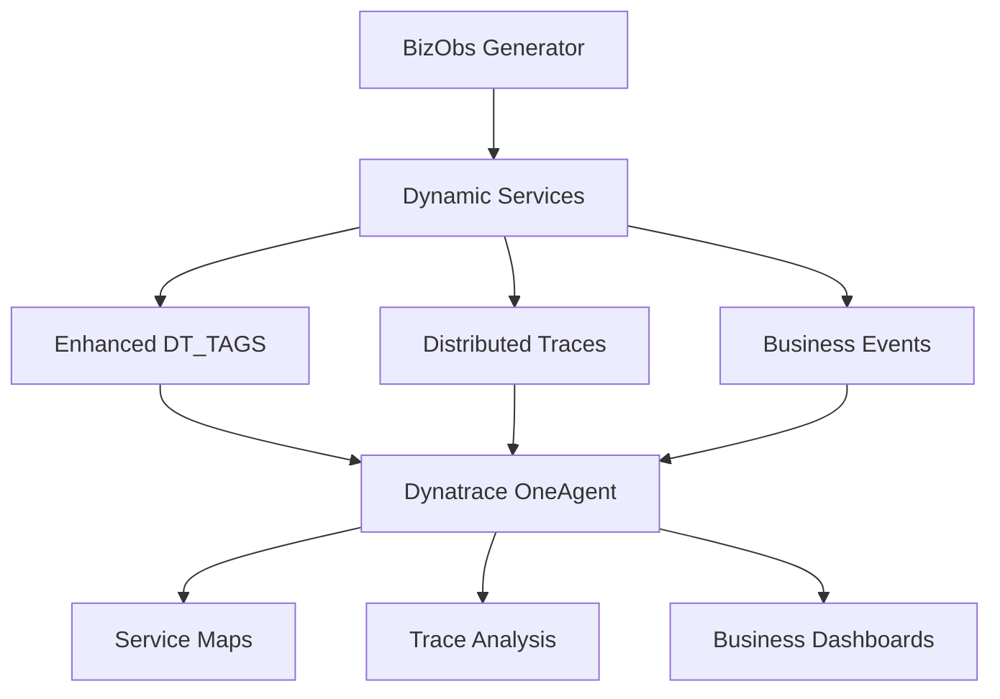

--8<-- "snippets/4-dynatrace-visualization.js"

# Visualizing Data in Dynatrace

Once your customer journey is running, the BizObs Generator automatically sends rich observability data to Dynatrace. This section shows you how to find, analyze, and visualize your business observability data using Dynatrace's powerful capabilities.

## 🎯 Data Flow Overview



## 🏗️ Finding Your Services

### Service Discovery
Your generated services automatically appear in Dynatrace with clean, identifiable names.

#### **Services View Navigation**
1. Navigate to **Services** in Dynatrace
2. Filter by **Technology: Node.js** 
3. Look for your company-specific services:
   - `ProductDiscoveryService`
   - `PricingEvaluationService`
   - `OrderPlacementService`

#### **Service Identification**
Services are tagged with comprehensive metadata:
```bash
company: microsoft
app: bizobs-journey  
service: productdiscoveryservice
industry-type: cloud_software
journey-detail: azure_enterprise_purchase
release-stage: production
environment: ace-box
```

### Service Details Analysis

#### **Service Overview**
Each service provides detailed metrics:
- **Response Time**: Average processing time per request
- **Throughput**: Requests per minute
- **Failure Rate**: Error percentage
- **Service Dependencies**: Upstream and downstream connections

#### **Business Context Tags**
In the service details, you'll find enhanced tags providing business context:
- **Industry Classification**: `industry-type=cloud_software`
- **Journey Context**: `journey-detail=azure_enterprise_purchase`
- **Company Context**: `company=microsoft`
- **Environment Info**: `environment=ace-box`

## 🔍 Distributed Trace Analysis

### Finding Your Journey Traces

#### **Trace Search**
1. Go to **Distributed Traces**
2. Use filters to find your journeys:
   ```
   Tag: company=microsoft
   Tag: journey-detail=azure_enterprise_purchase
   Service: ProductDiscoveryService
   ```

#### **Trace Structure**
Each complete journey shows as an end-to-end trace:
```
Journey Trace (7.8 seconds total)
├── ProductDiscoveryService (154ms)
│   ├── Business Context Loading (23ms)
│   ├── Service Processing (108ms)
│   └── Response Generation (23ms)
├── Think Time (250ms)
└── PricingEvaluationService (198ms)
    ├── Pricing Calculation (145ms)
    ├── Enterprise Discount Logic (31ms)
    └── Quote Generation (22ms)
```

### Trace Analysis Features

#### **Business Attributes**
Each span contains rich business context:
```json
{
  "journey.step": "ProductDiscovery",
  "journey.service": "ProductDiscoveryService", 
  "journey.correlationId": "a28fcc4f-d3e0-4290-ba40-4f138f2877aa",
  "journey.company": "Microsoft",
  "journey.industryType": "Cloud Software",
  "journey.processingTime": 154
}
```

#### **W3C Trace Context**
Proper distributed tracing with W3C headers:
- **traceparent**: `00-7d0860d958c80e4a41e1caf1f2466b2b-a2afe7b537bbdf41-01`
- **tracestate**: Dynatrace-specific trace state propagation
- **Cross-Service Correlation**: Maintains context across service boundaries

## 📊 Business Events & BizEvents

### Automatic BizEvents Generation

The BizObs Generator automatically creates business events for key journey milestones:

#### **Journey Step Completed**
```json
{
  "eventType": "bizevents.journey.step.completed",
  "timestamp": "2025-11-28T15:42:15.173Z",
  "company": "Microsoft",
  "industryType": "Cloud Software", 
  "journeyDetail": "Azure Enterprise Purchase",
  "stepName": "ProductDiscovery",
  "serviceName": "ProductDiscoveryService",
  "processingTime": 154,
  "businessValue": 2500.00,
  "customerSatisfaction": 4.2,
  "conversionProbability": 0.85
}
```

#### **Revenue Generation Events**
```json
{
  "eventType": "bizevents.revenue.generated",
  "timestamp": "2025-11-28T15:42:15.173Z",
  "company": "Microsoft",
  "revenueAmount": 2500.00,
  "currency": "USD",
  "journeyType": "Product Purchase",
  "customerTier": "Enterprise",
  "acquisitionChannel": "organic"
}
```

### BizEvents Analysis

#### **Finding BizEvents**
1. Navigate to **Business Analytics > BizEvents**
2. Filter by event types:
   - `bizevents.journey.*`
   - `bizevents.revenue.*`
   - `bizevents.customer.*`

#### **BizEvents Queries**
Create custom DQL queries for business insights:

```sql
fetch bizevents
| filter eventType == "bizevents.journey.step.completed"
| filter company == "Microsoft"
| summarize avgProcessingTime = avg(processingTime), 
            totalRevenue = sum(businessValue)
  by stepName
```

## 📈 Creating Business Dashboards

### Executive Summary Dashboard

#### **Key Metrics Tiles**
Create tiles showing critical business KPIs:

**Total Revenue Generated**
```sql
fetch bizevents
| filter eventType == "bizevents.revenue.generated"
| summarize totalRevenue = sum(revenueAmount)
```

**Journey Completion Rate**
```sql
fetch bizevents
| filter eventType contains "journey"
| summarize completionRate = (countDistinct(journeyId, success==true) / countDistinct(journeyId)) * 100
```

**Average Customer Satisfaction**
```sql
fetch bizevents
| filter isNotNull(customerSatisfaction)
| summarize avgSatisfaction = avg(customerSatisfaction)
```

#### **Journey Performance Analysis**
**Step-by-Step Performance**
```sql
fetch bizevents
| filter eventType == "bizevents.journey.step.completed"
| summarize avgTime = avg(processingTime),
            successRate = (count(success==true) / count()) * 100
  by stepName
| sort avgTime desc
```

### Technical Operations Dashboard

#### **Service Performance Metrics**
Combine technical and business metrics:

**Service Response Time vs Business Value**
```sql
fetch dt.service.key_request
| join (fetch bizevents, from:now-1h)
| summarize avgResponseTime = avg(dt.service.key_request.response_time),
            avgBusinessValue = avg(bizevents.businessValue)
  by dt.entity.service
```

#### **Error Impact Analysis**
Correlate technical errors with business impact:

```sql
fetch dt.service.errors
| join (fetch bizevents, from:now-1h) 
| where bizevents.success == false
| summarize errorCount = count(),
            revenueImpact = sum(bizevents.businessValue)
  by dt.entity.service, errorType
```

## 🎨 Advanced Visualization Techniques

### Service Flow Maps

#### **Business Journey Visualization**
Create custom service flow maps showing:
- **Journey Progression**: Step-by-step service flow
- **Business Value Flow**: Revenue generation through services
- **Performance Bottlenecks**: Slow steps impacting conversion

#### **Industry-Specific Views**
Filter service maps by industry context:
```
Filter: industry-type=cloud_software
Group by: journey-detail
Color by: Business Value Impact
```

### Custom Business Metrics

#### **Industry Benchmarking**
Compare performance across industry types:
```sql
fetch bizevents
| filter eventType == "bizevents.journey.step.completed"
| summarize avgProcessingTime = avg(processingTime),
            conversionRate = avg(conversionProbability)
  by industryType
```

#### **Journey Optimization Insights**
Identify optimization opportunities:
```sql
fetch bizevents
| filter processingTime > 200
| summarize slowSteps = count(),
            potentialRevenueLoss = sum(businessValue * (1 - conversionProbability))
  by stepName, company
```

## 🔧 Alerting & Monitoring

### Business-Critical Alerts

#### **Revenue Impact Alerts**
Alert when business metrics exceed thresholds:

**High Revenue Impact Errors**
```sql
fetch bizevents
| filter success == false AND businessValue > 1000
| count()
```
*Alert when > 5 high-value failures in 15 minutes*

**Conversion Rate Drop**
```sql
fetch bizevents
| filter eventType == "bizevents.journey.step.completed"
| summarize conversionRate = avg(conversionProbability)
| where conversionRate < 0.7
```
*Alert when conversion rate drops below 70%*

#### **Customer Experience Alerts**
Monitor customer satisfaction metrics:

**Customer Satisfaction Drop**
```sql  
fetch bizevents
| filter isNotNull(customerSatisfaction)
| summarize avgSatisfaction = avg(customerSatisfaction)
| where avgSatisfaction < 4.0
```
*Alert when satisfaction drops below 4.0/5.0*

### SLO Configuration

#### **Business SLOs**
Define Service Level Objectives tied to business outcomes:

**Journey Completion SLO**
- **Objective**: 95% of journeys complete successfully within 10 seconds
- **Measurement**: Journey completion rate and duration
- **Business Impact**: Revenue loss estimation

**Customer Satisfaction SLO**
- **Objective**: Maintain >4.0 customer satisfaction score
- **Measurement**: Average satisfaction from BizEvents
- **Business Impact**: Customer retention correlation

## 📊 Reporting & Analysis

### Executive Reports

#### **Monthly Business Summary**
Automated reports showing:
- **Total Revenue Generated**: By industry, journey type, company
- **Journey Performance Trends**: Completion rates, satisfaction scores
- **Technical Performance Impact**: Service issues affecting business metrics
- **Optimization Opportunities**: Potential improvements and ROI

#### **Industry Benchmarking Reports**
Compare performance across industries:
- **Processing Time Benchmarks**: Industry average vs your performance  
- **Conversion Rate Analysis**: Best practices from high-performing industries
- **Customer Satisfaction Trends**: Industry-specific satisfaction patterns

### Operational Analytics

#### **Service Optimization Reports**
Technical teams can use:
- **Performance Bottleneck Analysis**: Slowest services impacting business
- **Error Impact Assessment**: Technical issues with highest business cost
- **Capacity Planning**: Load patterns based on business growth
- **Architecture Recommendations**: Service dependencies and optimization

## 🚀 Advanced Use Cases

### A/B Testing Analysis
Use journey variations to test business impact:
```sql
fetch bizevents  
| filter journeyDetail contains "variant"
| summarize conversionRate = avg(conversionProbability),
            avgRevenue = avg(businessValue)
  by journeyDetail
```

### Customer Segmentation
Analyze different customer behaviors:
```sql
fetch bizevents
| extend customerTier = if(businessValue > 1000, "Enterprise", "Standard")
| summarize performance = avg(processingTime),
            satisfaction = avg(customerSatisfaction)
  by customerTier, industryType
```

### Predictive Analytics
Identify patterns for proactive optimization:
```sql
fetch bizevents, from:now-30d
| where conversionProbability < 0.5
| summarize commonFactors = collectArray(stepName)
  by company, industryType
```

!!! success "Comprehensive Observability Achieved!"
    Your BizObs Generator data is now fully integrated into Dynatrace, providing unprecedented visibility into the relationship between technical performance and business outcomes.

<div class="grid cards" markdown>
- [🔧 Advanced Journey Patterns :octicons-arrow-right-24:](5-advanced-features.md)
- [📚 API Reference & Integration :octicons-arrow-right-24:](6-resources.md)
</div>