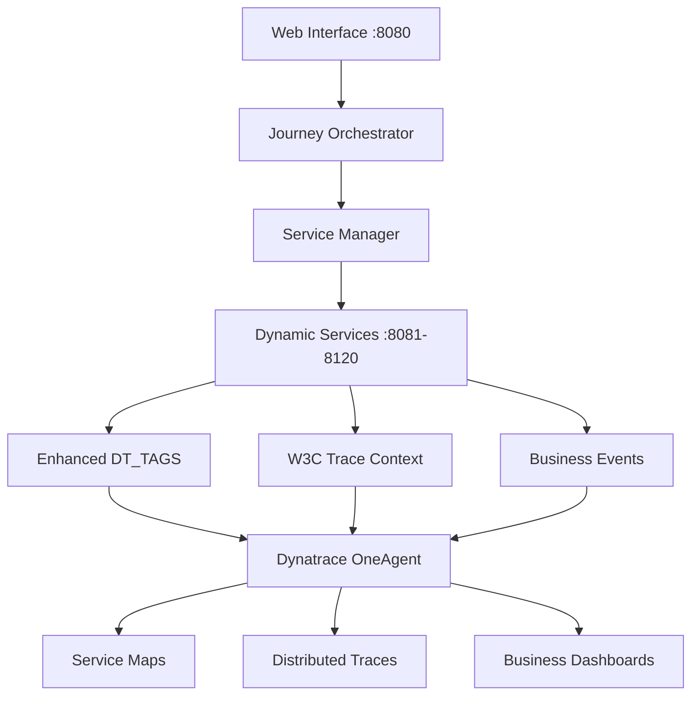

--8<-- "snippets/getting-started.js"

## 1. Prerequisites & Environment Setup

You will need access to a Dynatrace environment and the ability to run the BizObs Journey Simulator. The simulator generates real business observability data that flows directly into Dynatrace for comprehensive analysis.

### 1.1 Dynatrace Tenant Requirements

**Required Access:**
- Dynatrace SaaS or Managed tenant 
- Admin or Monitor privileges for viewing services and traces
- BizEvents access (recommended for business KPIs)

**Recommended Features:**
- **Service monitoring**: View auto-generated microservices with business context
- **Distributed tracing**: Analyze complete customer journey flows  
- **BizEvents**: Track business KPIs and revenue metrics
- **Dashboards**: Create business observability visualizations

### 1.2 Enable Enhanced Service Detection

The BizObs Generator creates services with enhanced metadata. To get the best experience:

**Go to Settings > Server-side service monitoring > Service detection rules**

Enable or verify these settings:
- **Full web request monitoring**: For complete journey trace capture
- **Monitor all incoming web requests**: To capture all business interactions
- **Service naming rules**: May be customized based on your preferences

### 1.3 Configure Dynatrace for Business Observability

**Critical Setup Steps for Full Business Visibility:**

The BizObs Generator creates rich business events that require proper Dynatrace configuration to capture and process effectively.

#### Enable OneAgent Features
1. **Open** "**Settings Classic**"
2. **Open** "**Preferences**" and "**OneAgent Features**"
3. **Filter by** "**Business**"
4. Enable the following:
   - Node.js Business Events [Opt-in]
5. **Restart** the Node.js server on the BizObs Application

#### Configure Business Event Capture Rule

**Create Capture Rule:**
1. **Open** "**Settings Classic**"
2. **Open** "**Business Analytics**" menu group
3. **Click** on "**OneAgent**"
4. **Click** on "**Add new capture rule**" on the **incoming** tab
5. For field "**Rule name**", **copy** and **paste**:
   ```
   BizObs Journey Simulator
   ```

**Configure Trigger:**
1. **Click** on "**Add trigger**"
2. For "**Data source**", **select** "**Request - Path**"
3. For "**Operator**", **select** "**starts with**"
4. For "**Value**", **copy** and **paste**:
   ```
   /process
   ```

**Configure Metadata (Provider):**
1. For "**Event provider Data Source**", **click** on "**Request - Body**"
2. For "**Field name**" and "**Path**", **copy** and **paste**:
   ```
   companyName
   ```

**Configure Metadata (Type):**
1. For "**Event type data source**", **click** on "**Request - Body**"
2. For "**Field name**" and "**Path**", **copy** and **paste**:
   ```
   stepName
   ```

**Configure Metadata (Category):**
1. For "**Event Category data source**", **select** "**Fixed Value**"
2. **Copy** and **paste**:
   ```
   BizObs Journey Simulator
   ```

**Configure Additional Data (Complete Request Body):**
1. **Click** on "**Add data field**"
2. For "**Data source**", **select** "**Request - Body**"
3. For "**Field name**", **copy** and **paste**:
   ```
   rqBody
   ```
4. For "**Path**", **copy** and **paste**:
   ```
   *
   ```

**Save the configuration** by clicking "**Save changes**" at the bottom.

#### Configure Service Naming Rules

**Create Service Naming Rule for Clean Service Identification:**
1. **Open** "**Settings Classic**"
2. **Open** "**Server-side Service monitoring**" menu group
3. **Click** on "**Service naming rules**"
4. For Rule name, **copy** and **paste**:
   ```
   BizObs Journey Services
   ```
5. For Service name format, **copy** and **paste**:
   ```
   {ProcessGroup:DetectedName}
   ```
6. For Conditions, **select** "**Detected process group name**" from dropdown
7. Change matcher to "**exists**"
8. Click "**Preview**" then "**Save changes**"

#### Configure OpenPipeline for Business Event Processing

**Create Pipeline:**
1. **Open** "**OpenPipeline**"
2. **Click** on "**Business events**" menu group
3. **Click** on "**Pipelines**"
4. **Create** a **new pipeline**
5. **Rename** the pipeline:
   ```
   BizObs Journey Processing Pipeline
   ```

**Add JSON Processing Rule:**
1. **Access** the "**Processing**" tab
2. From processor dropdown, **select** "**DQL**"
3. **Name** the processor:
   ```
   JSON Parser and Field Flattener
   ```
4. For "**Matching condition**", leave as **true**
5. For "**DQL processor definition**", **copy** and **paste**:
   ```
   parse rqBody, "JSON:json"
   | fieldsFlatten json
   | parse json.additionalFields, "JSON:additionalFields"
   | fieldsFlatten json.additionalFields, prefix:"additionalfields."
   ```

**Add Error Processing Rule:**
1. Add another processor from dropdown, **select** "**DQL**"
2. **Name** the processor:
   ```
   Error Event Type Handler
   ```
3. For "**Matching condition**", leave as **true**
4. For "**DQL processor definition**", **copy** and **paste**:
   ```
   fieldsAdd event.type = if(json.hasError == true, concat(event.type, " - Exception"), else:{event.type})
   ```

**Save** the pipeline configuration.

**Configure Dynamic Routing:**
1. **Access** the "**Dynamic routing**" tab
2. **Create** a **new Dynamic route**
3. For "**Name**", **copy** and **paste**:
   ```
   BizObs Journey Simulator
   ```
4. For "**Matching condition**", **copy** and **paste**:
   ```
   matchesValue(event.category, "BizObs Journey Simulator")
   ```
5. For "**Pipeline**", **select** "**BizObs Journey Processing Pipeline**"
6. **Click** "**Add**"
7. **Enable** the Dynamic Routing status
8. **Save** the configuration

The simulator will automatically generate comprehensive business events like:
```json
{
  "eventType": "bizevents.journey.step.completed",
  "company": "Microsoft", 
  "industryType": "Cloud Software",
  "journeyDetail": "Azure Enterprise Purchase",
  "businessValue": 2500.00,
  "customerSatisfaction": 4.2,
  "processingTime": 154,
  "conversionProbability": 0.85
}
```

## 2. Application Architecture Overview

The BizObs Journey Simulator creates a realistic microservices architecture that mirrors enterprise applications:



### What Gets Created:

**Main Application (Port 8080):**
- Business-focused web interface for journey creation
- AI-powered prompt generation for observability insights
- Real-time journey orchestration and monitoring

**Dynamic Microservices (Ports 8081-8120):**
- Company-specific services: `ProductDiscoveryService-Microsoft`
- Clean service naming: `PricingEvaluationService`, `OrderPlacementService`
- Enhanced metadata with business context
- Realistic processing times and business value generation

**Dynatrace Integration:**
- **13 comprehensive DT_TAGS** with business context
- **W3C distributed tracing** for complete journey visibility  
- **Automatic BizEvents** for business KPI tracking
- **Service dependencies** showing realistic business process flows

## 3. Deployment Options

### Option 1: GitHub Codespaces (Recommended)

!!! tip "Fastest Setup"
    Pre-configured environment with all dependencies and Dynatrace integration ready to use.

**Launch Steps:**
1. Navigate to: `https://github.com/dynatrace-wwse/bizobs-journey-simulator`
2. Click: **Code → Codespaces → Create codespace on main**
3. Wait for automatic setup (2-3 minutes)
4. Application starts automatically on port 8080

**What's Pre-Configured:**
- Node.js 18+ runtime environment
- All npm dependencies installed
- Port forwarding configured
- VS Code extensions for development

### Option 2: Local Development Setup

**Prerequisites:**
- Node.js 18+ installed
- Git for repository access
- 4GB+ available RAM for services

**Setup Commands:**
```bash
# Clone the repository
git clone https://github.com/dynatrace-wwse/bizobs-journey-simulator.git
cd bizobs-journey-simulator

# Navigate to the application directory
cd "BizObs Generator"

# Install dependencies
npm install

# Start the application
npm start
```

**Verify Installation:**
```bash
# Check application health
curl http://localhost:8080/api/health

# Expected response:
{
  "status": "ok",
  "mainProcess": {"pid": 12345, "uptime": 45.2, "port": 8080},
  "childServices": [
    {"service": "DiscoveryService-DefaultCompany", "running": true, "pid": 12346},
    {"service": "PurchaseService-DefaultCompany", "running": true, "pid": 12347},
    {"service": "DataPersistenceService-DefaultCompany", "running": true, "pid": 12348}
  ]
}
```

### Option 3: Production Deployment

**Container Deployment:**
```bash
# Using Docker Compose
docker-compose up -d

# Or Kubernetes
kubectl apply -f k8s/
```

**Production Considerations:**
- Configure persistent storage for journey data
- Set up load balancing for high availability
- Configure environment variables for Dynatrace integration
- Enable logging and monitoring

## 4. Verify Your Environment

### 4.1 Application Access

**Web Interface:** http://localhost:8080
- Should show the Business Observability Generator welcome page
- Four-step journey creation process clearly visible

**API Endpoints:** http://localhost:8080/api/
- `/api/health` - Application health status
- `/api/journey-simulation/*` - Journey creation and execution
- `/api/admin/*` - Service management endpoints

### 4.2 Service Generation Test

**Quick Test Journey:**
```bash
curl -X POST http://localhost:8080/api/journey-simulation/simulate-journey \
  -H "Content-Type: application/json" \
  -d '{
    "companyName": "TestCorp",
    "domain": "test.com",
    "industryType": "Technology",
    "journey": {
      "journeyType": "Quick Test",
      "journeyDetail": "Environment Validation",
      "steps": [
        {"stepName": "Welcome", "description": "Welcome step"},
        {"stepName": "Validation", "description": "Environment validation"}
      ]
    },
    "journeyId": "env_test_001",
    "customerId": "test_customer_001"
  }'
```

**Expected Results:**
- New services created: `WelcomeService-TestCorp`, `ValidationService-TestCorp`
- Services running on dynamic ports (8081-8120 range)
- Complete journey response with business metadata

### 4.4 Validate Business Events with DQL Queries

After running test journeys, verify your Dynatrace configuration is working correctly:

#### Basic Business Event Validation
**Open Notebooks in Dynatrace and run:**

**1. Verify Business Events are Being Captured:**
```sql
fetch bizevents
| filter isNotNull(rqBody)
| filter isNotNull(json.additionalFields) and isNotNull(json.stepIndex)  
| filter json.companyName == "TestCorp"  // Replace with your test company
| summarize count(), by:{event.type, json.stepName, json.stepIndex}
| sort json.stepIndex asc
```

**Expected Output:** Shows all journey steps with their event counts

**2. Complete Business Event Data:**
```sql
fetch bizevents  
| filter isNotNull(rqBody)
| filter isNotNull(json.additionalFields) and isNotNull(json.stepIndex)
| filter json.companyName == "TestCorp"  // Replace with your test company
| limit 10
```

**Expected Output:** Rich business event data with flattened JSON fields

**3. Journey Performance Analysis:**
```sql
fetch bizevents
| filter json.companyName == "TestCorp"  // Replace with your test company
| summarize avgTimeSpent = avg(toLong(json.processingTime)), 
           totalBusinessValue = sum(toDouble(json.businessValue))
           by:{event.type, json.stepName}
| fieldsAdd performanceRating = if(avgTimeSpent <= 200, "✅ Excellent", 
                                 if(avgTimeSpent <= 500, "⚠️ Good", "❌ Needs Improvement"))
```

**Expected Output:** Performance metrics with business value correlation

**4. Service Request Analysis:**
```sql
timeseries requests = sum(dt.service.request.count),
          by:{dt.entity.service}
| fields timeframe, 
        interval, 
        service = entityName(dt.entity.service),
        requests
| sort arraySum(requests) desc
```

**Expected Output:** Request counts for all your generated services

**5. Success vs Failure Rate:**
```sql
timeseries total = sum(dt.service.request.count, default:0),
          failed = sum(dt.service.request.failure_count, default:0),
          nonempty: true
| fieldsAdd success = total[] - failed[]
| fieldsAdd successRate = (success[] / total[]) * 100
| fields timeframe, interval, success, failed, successRate
```

**Expected Output:** Success rates for your journey services

!!! success "Validation Complete!"
    If these queries return data, your Dynatrace environment is properly configured to capture and process business observability data from the BizObs Journey Simulator.

### 4.3 Dynatrace Data Flow Verification

**Within 2-3 minutes, check your Dynatrace tenant:**

**Services View:**
- Look for new Node.js services with clean names
- Services tagged with comprehensive business metadata
- Service dependencies showing journey flow

**Distributed Traces:**
- Search for traces with `company=testcorp` tag
- Complete journey traces with business context
- W3C trace context properly propagated

**Optional - BizEvents:**
- Business events for journey completion
- Revenue and customer satisfaction metrics
- Industry-specific business context

## 5. Architecture Deep Dive

### Enhanced DT_TAGS Structure
Every service gets comprehensive business metadata:
```bash
company=microsoft
app=bizobs-journey  
service=productdiscoveryservice
release-stage=production
owner=ace-box-demo
customer-id=microsoft-demo
environment=ace-box
product=dynatrace
domain=www_microsoft_com
industry=cloud_software
industry-type=cloud_software
journey-detail=azure_enterprise_purchase
```

### Service Naming Conventions
- **Clean Names**: `ProductDiscoveryService`, `PricingEvaluationService`
- **Company Context**: `ProductDiscoveryService-Microsoft`
- **No Duplicates**: Eliminated redundant suffixes like `ServiceProcessService`
- **Business Aligned**: Names reflect actual business processes

### Distributed Tracing
- **W3C Standard**: Proper `traceparent` and `tracestate` headers
- **Business Context**: Journey metadata in every span
- **Cross-Service**: Complete visibility across all journey steps
- **Error Handling**: Failure scenarios with business impact tracking

!!! success "Environment Ready!"
    Your BizObs Journey Simulator environment is now configured and ready for creating comprehensive customer journeys with full business observability.

<div class="grid cards" markdown>
- [Let's launch Codespaces :octicons-arrow-right-24:](codespaces.md)
</div>