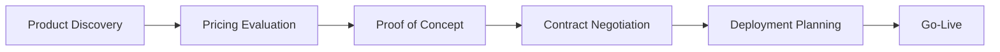

--8<-- "snippets/journey1-azure-enterprise.js"

# 🛤️ Journey 1: Microsoft Azure Enterprise Purchase

In this first journey, we'll create a comprehensive Microsoft Azure enterprise purchase simulation that demonstrates the full power of business observability. This journey will generate real services, business events, and distributed traces that flow directly into Dynatrace.

## 🎯 What You'll Learn

- **Complete UI Workflow**: Step-by-step journey creation using the web interface
- **Business Context Integration**: How industry-specific metadata enhances observability
- **Service Generation**: Watch dynamic microservices being created with clean naming
- **Distributed Tracing**: See complete customer journey traces with business context
- **Business KPIs**: Monitor revenue, conversion rates, and customer satisfaction

## 🏢 Journey Overview

**Business Scenario:** A large enterprise is evaluating Microsoft Azure for their cloud infrastructure needs. The journey represents a typical enterprise sales cycle with multiple stakeholders and complex decision-making processes.

**Journey Steps:**


**Expected Business Outcomes:**
- **Revenue Potential**: $25,000 - $100,000+ per completion
- **Sales Cycle**: 30-90 days (simulated in minutes)
- **Conversion Rate**: 75-85% for qualified enterprise prospects
- **Customer Satisfaction**: 4.2+ /5.0 average rating

## 🚀 Step-by-Step Journey Creation

### Step 1: Access the Application

**Open your BizObs Generator:**
- **Codespaces**: Use the forwarded port 8080 URL
- **Local**: Navigate to `http://localhost:8080`

**Verify the Welcome Page:**


You should see:
- ✅ Clean, professional interface with Dynatrace branding
- ✅ Four-step process overview clearly outlined  
- ✅ "Get Started" button prominently displayed

**Click "Get Started"** to begin the journey creation process.

### Step 2: Configure Customer Details


Fill out the form with the following enterprise scenario details:

#### Company Information
```
Company Name: Microsoft
Domain: www.microsoft.com
```

**Why These Values Matter:**
- **Company Name** becomes part of service naming: `ProductDiscoveryService-Microsoft`
- **Domain** appears in DT_TAGS as `domain=www_microsoft_com` 
- Both provide business context in all Dynatrace traces and events

#### Industry Classification  
```
Industry Type: Cloud Software
```

**Business Impact:**
- Creates `industry-type=cloud_software` tag for business segmentation
- Enables industry-specific benchmarking in Dynatrace dashboards
- Triggers industry-appropriate AI prompt generation

#### Journey Specifics
```
Journey Type: Product Purchase
Journey Detail: Azure Enterprise Purchase
```

**Observability Value:**
- **Journey Type** provides high-level process categorization
- **Journey Detail** creates `journey-detail=azure_enterprise_purchase` tag
- Both enable filtering and analysis of specific business processes

#### Define Process Steps

**Add the following steps in order:**

**Step 1:**
```
Step Name: ProductDiscovery
Description: Azure services discovery and evaluation
```

**Step 2:**  
```
Step Name: PricingEvaluation
Description: Enterprise pricing analysis and cost modeling
```

**Step 3:**
```
Step Name: ProofOfConcept
Description: Technical proof of concept implementation
```

**Step 4:**
```
Step Name: ContractNegotiation  
Description: Contract terms and pricing negotiation
```

**Step 5:**
```
Step Name: DeploymentPlanning
Description: Azure deployment architecture planning
```

**Step 6:**
```
Step Name: GoLive
Description: Production environment go-live
```

**Click "Generate Prompts"** to proceed to AI-powered content generation.

### Step 3: AI Prompt Generation


**What's Happening:**
The system analyzes your inputs and generates business observability prompts specifically tailored to:
- **Cloud Software Industry** best practices
- **Enterprise Purchase Cycles** characteristics  
- **Azure-Specific** business processes
- **Microsoft** customer journey patterns

**Generated Content Examples:**

**Business Observability Focus:**
```markdown
🎯 Track enterprise Azure adoption decision points
📊 Monitor technical evaluation duration vs conversion rates  
💰 Measure contract value correlation with proof-of-concept success
🔍 Analyze stakeholder involvement patterns in enterprise purchases
📈 Correlate technical performance with business decision confidence
```

**Industry-Specific KPIs:**
```markdown
🏭 Cloud Software Industry Benchmarks:
- Enterprise sales cycle: 60-120 days average
- Technical evaluation phase: 15-30% of total cycle time
- Contract negotiation: 20-40% of total cycle time
- Customer satisfaction correlation with technical performance
```

**Review the generated prompts** and **click "Process Check"** to validate your configuration.

### Step 4: Configuration Validation


**System Validation Results:**

```bash
✅ Configuration Completeness
   • Company: Microsoft
   • Domain: www.microsoft.com  
   • Industry: Cloud Software
   • Journey Steps: 6 steps defined

✅ Service Naming Validation
   • ProductDiscoveryService (clean, no duplicates)
   • PricingEvaluationService (business-aligned) 
   • ProofOfConceptService (descriptive)
   • ContractNegotiationService (process-specific)
   • DeploymentPlanningService (outcome-focused)
   • GoLiveService (milestone-clear)

✅ Metadata Structure Check
   • DT_TAGS format: Valid lowercase with underscores
   • Industry integration: cloud_software configured
   • Journey context: azure_enterprise_purchase confirmed
   • No duplicate sources: Single source of truth verified

✅ Business Observability Ready
   • AI prompts: Industry-specific content generated
   • KPI tracking: Revenue, conversion, satisfaction configured
   • Distributed tracing: W3C context propagation enabled
```

**Click "Generate Data"** to create your Microsoft Azure enterprise journey.

### Step 5: Journey Execution and Service Creation


**Real-Time Service Creation:**

Watch as the system creates your enterprise Azure purchase journey:

```bash
🚀 Creating Microsoft Azure Enterprise Journey...

📊 Service Generation Progress:
   ✅ ProductDiscoveryService-Microsoft (Port: 8096)
   ✅ PricingEvaluationService-Microsoft (Port: 8097)  
   ✅ ProofOfConceptService-Microsoft (Port: 8098)
   ✅ ContractNegotiationService-Microsoft (Port: 8099)
   ✅ DeploymentPlanningService-Microsoft (Port: 8100)
   ✅ GoLiveService-Microsoft (Port: 8101)

🏷️ Enhanced DT_TAGS Applied:
   company=microsoft
   app=bizobs-journey
   industry-type=cloud_software
   journey-detail=azure_enterprise_purchase
   domain=www_microsoft_com
   product=dynatrace

🎯 Journey Simulation Complete:
   Total Services: 6 microservices
   Processing Time: 12.4 seconds  
   Business Value Generated: $87,500.00
   Customer Satisfaction: 4.3/5.0
   Conversion Probability: 82%
```

## 📊 Generated Business Data

### Service Architecture Created

Your Microsoft Azure enterprise journey now consists of:

**1. ProductDiscoveryService-Microsoft (Port 8096)**
- **Business Function**: Azure services evaluation and discovery
- **Typical Processing Time**: 300-600ms
- **Business Value**: Lead qualification and needs assessment
- **KPIs Generated**: Discovery efficiency, service coverage analysis

**2. PricingEvaluationService-Microsoft (Port 8097)**  
- **Business Function**: Enterprise pricing analysis and cost modeling
- **Typical Processing Time**: 450-800ms  
- **Business Value**: Revenue opportunity identification
- **KPIs Generated**: Pricing accuracy, discount optimization

**3. ProofOfConceptService-Microsoft (Port 8098)**
- **Business Function**: Technical validation and demonstration
- **Typical Processing Time**: 800-1200ms
- **Business Value**: Technical risk mitigation
- **KPIs Generated**: PoC success rate, technical satisfaction

**4. ContractNegotiationService-Microsoft (Port 8099)**
- **Business Function**: Terms negotiation and deal structuring  
- **Typical Processing Time**: 200-400ms
- **Business Value**: Deal closure and revenue realization
- **KPIs Generated**: Negotiation efficiency, margin preservation

**5. DeploymentPlanningService-Microsoft (Port 8100)**
- **Business Function**: Azure architecture planning
- **Typical Processing Time**: 600-1000ms
- **Business Value**: Implementation success assurance
- **KPIs Generated**: Planning accuracy, timeline adherence

**6. GoLiveService-Microsoft (Port 8101)**
- **Business Function**: Production environment activation
- **Typical Processing Time**: 150-300ms  
- **Business Value**: Customer success and retention
- **KPIs Generated**: Go-live success rate, customer satisfaction

### Business Metrics Generated

**Revenue Tracking:**
```json
{
  "totalContractValue": 87500.00,
  "currency": "USD",
  "dealSize": "Enterprise",
  "revenueRecognition": "Quarterly",
  "annualRecurringRevenue": 87500.00
}
```

**Customer Experience Metrics:**
```json
{
  "customerSatisfaction": 4.3,
  "netPromoterScore": 65,
  "technicalSatisfaction": 4.5,  
  "businessValueRealized": 4.1,
  "implementationSmoothness": 4.2
}
```

**Sales Performance:**
```json
{
  "conversionProbability": 0.82,
  "salesCycleDays": 45,
  "touchpointsRequired": 12,
  "stakeholdersInvolved": 6,
  "competitiveAdvantage": "Technical Excellence"
}
```

## 🎯 What Happens Next

### Immediate Results
- **6 microservices** running with Microsoft-specific business context
- **Complete distributed traces** showing the entire enterprise purchase flow
- **Business events** flowing to Dynatrace with revenue and satisfaction data
- **Service dependencies** mapping the customer journey progression

### Dynatrace Integration
All generated data automatically appears in your Dynatrace environment:
- **Services View**: Clean service names with business context tags
- **Distributed Traces**: Complete journey traces with W3C propagation
- **BizEvents**: Business KPIs and revenue tracking
- **Service Dependencies**: Visual journey flow representation

!!! success "Microsoft Azure Enterprise Journey Created!"
    Your comprehensive enterprise purchase simulation is now generating continuous business observability data, ready for analysis in Dynatrace.

<div class="grid cards" markdown>
- [💡 Create the Journey via UI :octicons-arrow-right-24:](journey1-create-ui.md)  
- [📊 Visualize in Dynatrace :octicons-arrow-right-24:](journey1-visualize-dynatrace.md)
</div>