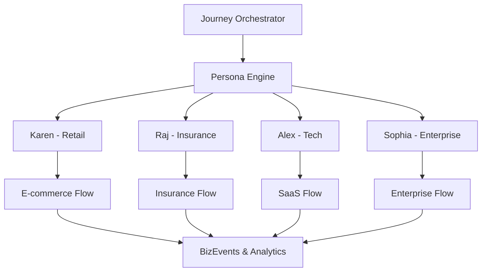

# Customer Journeys Overview

Welcome to the comprehensive guide for customer journeys in the BizObs Journey Simulator. This section provides detailed documentation on our 4 distinct customer personas, their behavioral patterns, and the sophisticated journey simulations you can create.

## 🎭 Persona-Driven Journey Architecture

Our journey system is built around realistic customer personas, each with unique characteristics, preferences, and behavioral patterns that reflect real-world customer segments:



## 🔍 Journey Types by Business Domain

### 1. **Retail E-Commerce** (Karen's Expertise)
- **Journey Steps**: Discovery → Browse → Compare → Cart → Checkout → Payment → Confirmation
- **Duration**: 3-8 minutes
- **Complexity**: Medium (8 microservices)
- **Revenue Range**: $45-85
- **Conversion Rate**: 68%

### 2. **Insurance & Financial Services** (Raj's Domain)
- **Journey Steps**: Research → Quote → Compare → Application → Underwriting → Payment → Policy Issue
- **Duration**: 15-25 minutes  
- **Complexity**: High (12 microservices)
- **Revenue Range**: $180-350
- **Conversion Rate**: 84%

### 3. **Technology & SaaS** (Alex's Territory)
- **Journey Steps**: Discovery → Trial → Evaluation → Integration → Purchase → Activation
- **Duration**: 8-15 minutes
- **Complexity**: Medium-High (10 microservices)
- **Revenue Range**: $95-180
- **Conversion Rate**: 72%

### 4. **Enterprise B2B** (Sophia's Process)
- **Journey Steps**: Evaluation → Demo → RFP → Procurement → Approval → Contract → Implementation
- **Duration**: 45-90 minutes
- **Complexity**: Very High (15 microservices)
- **Revenue Range**: $2500-5000
- **Conversion Rate**: 91%

## 🎯 Business Observability Integration

Each journey generates comprehensive business observability data:

### Key Metrics Tracked
- **Revenue per Journey**: Realistic monetary values based on persona
- **Conversion Funnel**: Step-by-step success/failure rates
- **Customer Satisfaction**: Persona-specific satisfaction scoring
- **Time to Completion**: Journey duration and step timing
- **Error Impact**: How technical issues affect business outcomes

### BizEvents Generated
```javascript
{
  "eventType": "bizevents.journeys.step_completed",
  "persona": "Karen",
  "journey": "ecommerce",
  "step": "payment",
  "revenue": 67.50,
  "customerSatisfaction": 4.2,
  "timestamp": "2024-11-28T10:30:00Z",
  "sessionId": "sess_karen_123456",
  "technicalMetrics": {
    "responseTime": 245,
    "errorCount": 0,
    "serviceHealth": 98.5
  }
}
```

## 🚀 Getting Started with Journeys

### Quick Journey Simulation

1. **Select Your Persona**
   ```bash
   curl -X POST http://localhost:8080/api/journey/start \
     -H "Content-Type: application/json" \
     -d '{"persona": "Karen", "journey": "ecommerce"}'
   ```

2. **Monitor Real-Time Progress**
   ```bash
   # WebSocket connection for live updates
   wscat -c ws://localhost:8080/ws/journeys
   ```

3. **View Business Metrics**
   ```bash
   curl http://localhost:8080/api/metrics/journey/summary
   ```

### Journey Configuration Options

```json
{
  "persona": "Karen|Raj|Alex|Sophia",
  "journey": "ecommerce|insurance|saas|enterprise",
  "config": {
    "errorRate": 0-20,
    "thinkTimeMs": 1000-5000,
    "iterations": 1-100,
    "includeErrors": true,
    "generateLoadRunner": true
  }
}
```

## 📊 Performance & Load Testing

Each journey automatically generates LoadRunner scripts for performance testing:

### Generated Artifacts
- **C-Scripts**: Complete LoadRunner test scripts
- **Parameter Files**: Data-driven test configurations
- **Scenarios**: Load patterns (light, medium, heavy, spike, stress)
- **Correlation Rules**: Dynamic value extraction

### Load Test Scenarios
```bash
# Light Load - 10 users, 5min ramp
# Medium Load - 50 users, 10min ramp  
# Heavy Load - 200 users, 15min ramp
# Spike Test - 500 users, 1min spike
# Stress Test - 1000 users, sustained
```

## 🎪 Advanced Error Simulation

Test observability and resilience with realistic failure patterns:

### Error Categories
- **Payment Gateway**: Timeouts, declines, processing errors
- **Service Dependencies**: Database, API, authentication failures
- **Performance Issues**: Slow responses, memory leaks, CPU spikes
- **Network Problems**: Connectivity, DNS, SSL certificate issues

### Error Configuration
```bash
curl -X POST http://localhost:8080/api/simulate/error \
  -d '{
    "type": "payment_gateway_timeout",
    "severity": "high",
    "duration": "5m",
    "affectedPersona": "Karen",
    "impactRevenue": true
  }'
```

## 📈 Business Intelligence Dashboard

Monitor journey performance with comprehensive business metrics:

```
📊 Journey Performance Dashboard
├─ 💰 Total Revenue: $1,247.50 (↑12.3%)
├─ 📈 Overall Conversion: 73.2% (↓2.1%)
├─ 😊 Avg Satisfaction: 4.3/5 (↑0.2)
├─ ⏱️ Avg Duration: 8.4 min (↓1.2 min)
├─ 🔄 Active Sessions: 12
└─ 🎯 Top Performer: Sophia (91% conversion)
```

## 🔗 Next Steps

Explore the detailed persona documentation to understand each customer type's specific behaviors, preferences, and journey patterns:

<div class="grid cards" markdown>
- [🛍️ Karen - Retail Customer](persona-karen.md)
- [🛡️ Raj - Insurance Professional](persona-raj.md)  
- [🚀 Alex - Tech Enthusiast](persona-alex.md)
- [🏢 Sophia - Enterprise Buyer](persona-sophia.md)
- [🔧 Custom Journey Builder](custom-journeys.md)
</div>

!!! tip "Journey Recommendations"
    - Start with **Karen** for quick e-commerce simulations
    - Try **Raj** for complex multi-step workflows  
    - Use **Alex** for API-heavy technology integrations
    - Deploy **Sophia** for enterprise-scale testing
    - Build **Custom Journeys** for your specific use cases